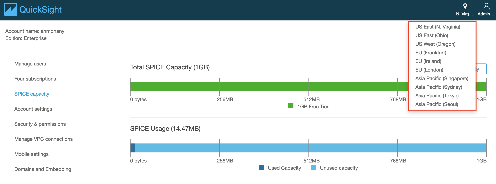
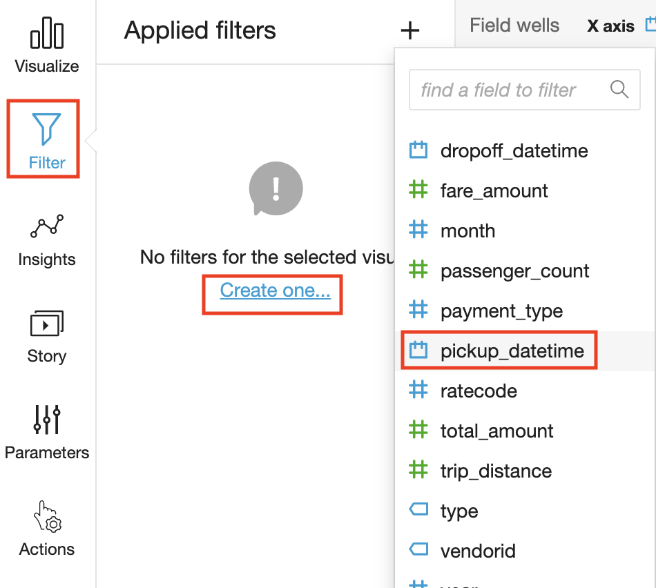
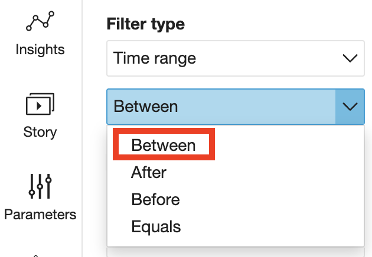
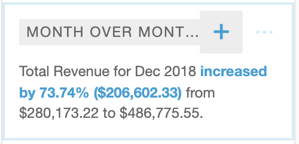

## How to visualizing  data using  QuickSight from a SQL Database. 

Today in this blog post, I will explain how to visualizing  data using **Amazon** **QuickSight** from a **SQL Database** and explain how to  create a **dataframe** in a data warehouse **S3** by using **Sagemake**r from a **SQL** queries using **Athena**.

Le us assume that you company has a **Relational database** and you have the task to create a **dataframe** to  perform  **Data Analysis** in **Sagemaker** and **Quicksight**.

A possible **solution** is depicted in the following diagram:


This solution is a way to create a **beautiful dashboard** in **AWS** with **Quicksight** .

 Let us build the previous diagram.


## Creation of Relation Database with RDS

Let us first create the Relational Database. Sign in to the AWS Management Console and open the Amazon RDS console at

 https://console.aws.amazon.com/rds/.


In the upper-right corner of the Amazon RDS console, choose the AWS Region in which you want to create the DB instance.In the navigation panel, choose **Databases**.


Choose **Create database**.

In **Choose a database creation method**, 

select **Standard create**.

In **Engine options**, we choose MySQL. 

To this project le us choose the Free tier.


In **Settings** sections we  add the master  password,


In  **Storage** section we **disable** the storage **autoscaling**, in this example we do not require use this feature


In the **Connectivity** section  we choose for **Public access** Yes


In **Database authentication** section  and we keep the **default settings** and press **Create database**. 

We wait until is created the database.


In order to connect to MySQL, you will have to authorize the IP address of the host from which you plan to connect to MySQL. 

You should also revoke access from the CIDR you currently have authorized. If you don’t know your computer’s IP address, you can see it by visiting the site [http://checkip.amazonaws.com/](http://checkip.amazonaws.com/).

 Note that you will have to add “/32” to the end of this to convert the IP address to a CIDR which contains only that IP address. For example, if your IP address is 192.0.2.10, you should authorize access to the CIDR 192.0.2.10/32.

 Go to your **security group**


In **Security Groups** click on  Inbound rules 


and then edit **inboud rules** and **add rule**


the type we select **MYSQL/Aurora** and for this project let choose as **Source type** **My IP**


and  click **save rules**.

You will have


Now is time to connect with our Database.

### Connecting to a DB instance running the MySQL database

After Amazon RDS provisions your DB instance, you can use any standard MySQL client application 


# Connecting  to RDS with  Ubuntu 20.04

Let us create a new  project folder

```
mkdir project
```

```
cd project
```

then type

```
pwd 
```

```
/home/ubuntu/project
```

we will use this folder to download the demo database. 

To install the MySQL command-line client on most DEB-based Linux distributions, run the following command:

```
sudo apt update
```

```
sudo apt-get upgrade
```

```
sudo apt-get install mariadb-client
```

Working with RDSI prefer the MariaDB-client over  `mysql-client-8.0`

To check the version of your MySQL command-line client, run the following command:

```
mysql --version
```

you will get something like

```
ubuntu@ip-132-34-28-92:~/project$ mysql --version
mysql  Ver 15.1 Distrib 10.3.32-MariaDB, for debian-linux-gnu (x86_64) using readline 5.2
```

### Load the Sample Database into MySQL Server


We use the `classicmodels` database as a **MySQL sample database** to help you work with MySQL quickly and effectively. The `classicmodels` database is a retailer of scale models of classic cars database. It contains typical business data such as customers, products, sales orders, sales order line items, etc.

The MySQL sample database schema consists of the following tables:

- **Customers**: stores customer’s data.
- **Products**: stores a list of scale model cars.
- **ProductLines**: stores a list of product line categories.
- **Orders**: stores sales orders placed by customers.
- **OrderDetails**: stores sales order line items for each sales order.
- **Payments**: stores payments made by customers based on their accounts.
- **Employees**: stores all employee information as well as the organization structure such as who reports to whom.
- **Offices**: stores sales office data.

Download the  sample database from to this project

```
wget https://raw.githubusercontent.com/ruslanmv/How-to-create-a-dataframe-in-S3-from-SQL-queries/master/mysqlsampledatabase.sql
```

To get a certificate bundle that contains both the intermediate and root certificates for all AWS Regions, download from https://truststore.pki.rds.amazonaws.com/global/global-bundle.pem

```
wget https://truststore.pki.rds.amazonaws.com/global/global-bundle.pem
```

On the **Connectivity & security** tab, copy the endpoint. Also, note the port number. You need both the endpoint and the port number to connect to the DB instance.


In our **example**

```
Endpoint
database-1.cn1rp959xqj3.us-east-1.rds.amazonaws.com
Port
3306
```

To connect to a DB instance using the MySQL command-line client, enter the following command at a command prompt to connect to a DB instance using the MySQL command-line client.

```
mysql -h database-1.cn1rp959xqj3.us-east-1.rds.amazonaws.com --ssl-ca=global-bundle.pem -P 3306 -u admin -p
```

or

```
mysql -h database-1.cn1rp959xqj3.us-east-1.rds.amazonaws.com -P 3306 -u admin -p
```

 For the **-h** parameter, substitute the DNS name (**endpoint**) for your DB instance. For the **-P** parameter, substitute the **port** for your DB instance. For the **-u** parameter, substitute the **user name** of a valid database user, such as the master user. Enter the master user password when prompted.


To load to load data into the MySQL Server we can use the `source` command 

```
source /home/ubuntu/project/mysqlsampledatabase.sql
```


Use the `SHOW DATABASES` command to list all databases in the current server:

```
show databases;
```


The output will look like the following that includes the newly created `classicmodels` database:

```
+--------------------+
| Database           |
+--------------------+
| classicmodels      |
| information_schema |
| mysql              |
| performance_schema |
| sys                |
+--------------------+
```

```
USE classicmodels;
SELECT * FROM customers;
```

Basically, those statements switch the current database to `classicmodels` and query data from the `customers` table.

 If you see the customer data returned, you have successfully imported the sample database into the MySQL database server.


## Connecting to RDS with  Windows 10

We first need to have installed Chocolatey in Windows as explained [here](https://chocolatey.org/install)

Then we open the terminal as admin in windows and we install **wget**

```
choco install wget
```


after we installed we can exit from admin and enter again to cmd as normal user and type the following

```
cd \
mkdir project
```

Download the  sample database from to this project

```
wget https://raw.githubusercontent.com/ruslanmv/How-to-create-a-dataframe-in-S3-from-SQL-queries/master/mysqlsampledatabase.sql
```

To get a certificate bundle that contains both the intermediate and root certificates for all AWS Regions, download from https://truststore.pki.rds.amazonaws.com/global/global-bundle.pem

```
wget https://truststore.pki.rds.amazonaws.com/global/global-bundle.pem
```

If you are interes we choose  MySQL Shell on Microsoft Windows using the MSI Installer, so we download the  package from http://dev.mysql.com/downloads/shell/.

When prompted, click Run and follow the steps in the Setup Wizard and finally in the terminal we type

```
mysqlsh -h database-1.cn1rp959xqj3.us-east-1.rds.amazonaws.com -P 3306 -u admin -p
```


and finally we load to load data into the MySQL Server we can use the `source` command

```
source c:\project\mysqlsampledatabase.sql
```

and to perform actions in SQL format we type

Use the `SHOW DATABASES` command to list all databases in the current server:

```
show databases;
```


The output will look like the following that includes the newly created `classicmodels` database:

```
+--------------------+
| Database           |
+--------------------+
| classicmodels      |
| information_schema |
| mysql              |
| performance_schema |
| sys                |
+--------------------+
```

```
USE classicmodels;
SELECT * FROM customers;
```

Basically, those statements switch the current database to `classicmodels` and query data from the `customers` table.

 If you see the customer data returned, you have successfully imported the sample database into the MySQL database server.


```
SHOW COLUMNS FROM customers;
```


# How to connect AWS RDS MySQL Server with AWS Glue


AWS Cloud offers a variety of data repositories like AWS RDS, AWS DynamoDB, AWS Redshift and many others. AWS RDS supports six different types of databases namely Aurora, MariaDB, SQL Server, Postgres, MySQL and Oracle. With a variety of data repositories on the cloud, there is often a need to hold inventory of all the data repositories and database objects held in those repositories in a central location. This central inventory is also known as the data catalog. AWS Glue is a serverless managed service that supports metadata cataloging and ETL (Extract Transform Load) on the AWS cloud. To perform these operations on AWS RDS for SQL Server, one needs to integrate AWS Glue with AWS RDS for SQL Server instance. 

The following workflow diagram shows how AWS Glue crawlers interact with data stores and other elements to populate the Data Catalog.


## Introduction to AWS Glue

AWS Glue is a serverless service offering from AWS for metadata crawling, metadata cataloging, ETL, data workflows and other related operations. AWS Glue can be used to connect to different types of data repositories, crawl the database objects to create a metadata catalog, which can be used as a source and targets for transporting and transforming data from one point to another. AWS Glue supports workflows to enable complex data load operations. Usually, the first step for any operation is connecting to the data source of interest by creating a new connection. 


The left pane contains different options which are categorized majorly into Data catalog, ETL and Security. Once you are on the home page of AWS Glue service, click on the Connection tab on the left pane and you would be presented with a screen as shown below.


#### Creation of a new connection to our AWS RDS SQL Server instance.


Click on the Add connection button to start creating a new connection. 

A new wizard screen would appear which will have multiple steps to collect details regarding the data source to which we intend to create a connection. 

The first step is to provide a **Connection name.** 

`MySQLConnection`

Next, we must select the type of connection. In the **Connection type** dropdown, you can find the options as shown below. Of all the supported options, we need to **select Amazon RDS** as it’s the service that holds our MySQL Server instance.

Once you select it, the next option of **Database engine** type would appear, as AWS RDS supports six different types of database mentioned above. Of all the supported databases, we need to select MySQL. and then click on Next.


After selecting the instance name `database-1,` and database connection credentials and database name for this project `classicmodels` and username as `admin` and  password you created to access to the Amazon RDS for MySQL Server instance click Next.


The next step just requires reviewing the details that we have provided in these two steps and confirm the creating of a new connection. Review the details and create a new connection. Once the connection is created, it would appear in the connections list as shown below.


Now that the connection is created, it’s time to test the connection. But before to that we need to crete an s3 VPC gateway edpoint. You can read more about these configuration requirements from [here](https://docs.aws.amazon.com/glue/latest/dg/start-connecting.html).

**Setting up an S3 VPC gateway endpoint**

To set up an S3 VPC gateway endpoint, do the following:

1. Open the Amazon VPC console.
2. In the navigation pane, choose Endpoints.
3. Choose Create Endpoint.
4. For Service Name, select com.amazonaws.us-east-1.s3. Be sure that the Type column indicates Gateway. Note: Be sure to replace us-east-1 with the AWS Region of your choice.
5. For VPC, select the VPC where you want to create the endpoint.
6. For Configure route tables, a route to the S3 VPC endpoint is automatically added.
7. For Policy, you can leave the default option Full Access.
8. Choose Create Endpoint.


### Testing connection

Return back to connections and there  Click on the Test Connection button and it would start opening an active connection to the AWS RDS SQL Server instance. 


Assuming the correct network configuration is in place, when you test the connection, it would succeed as shown below.


Once the connection is created and tested, you can click on the **Actions** menu to edit the connection, delete the connection, or view the details of the connection. 

Consider reading this [article](https://docs.aws.amazon.com/glue/latest/dg/connection-defining.html) to understand more details regarding AWS Glue connection properties.

[](https://www.sqlshack.com/wp-content/uploads/2020/07/aws-rds-instance-connection-usage-in-aws-glue-etl.png)

Once the connection is in place, the same can be used in ETL Jobs and Workflows


## Crawling AWS RDS SQL Server with AWS Glue

 Once the connection is in place,  choose **Add Database**. 


Provide a database **name** `athenards` and choose create.


Once the database name is created  click on the **Crawlers** in the left pane and you would see an interface as shown below.


Click on the **Add crawler** button to start creating a new crawler. The first step of defining a crawler is shown below. Provide a relevant name for the crawler. 


, click **Next**.

In this step, we need to specify the source data repository for the crawlers. We can select either data repositories or already cataloged objects. In our case, as we are going to point the crawler to AWS RDS SQL Server instance, we will choose the **Data stores** option. After selecting this option, click **Next**.


AWS Glue supports three types of data stores or repositories based on the mode of access. Data files hosted on S3 files, databases that support JDBC connectivity, and AWS DynamoDB database are the three types of data repositories that are supported. We would be using JDBC connectivity to connect to the AWS RDS MySQL Server database instance, so select the JDBC option.


As mentioned earlier, we need to have a connection to our AWS RDS SQL Server instance to select from the connection list. If you do not have any instance available, click on **Add connection** and create a new connection to the SQL Server instance. The “Include path” section expects the path to database objects. It supports wild-card patterns as well as exact object paths. The format that is generally followed is mydatabase/myschema/myobjects. It’s interesting to understand the effect of providing an incorrect path. So, for now, let’s just mention the master database, and our connection also points to the master database. Alternatively, if you intend to catalog many objects, and ignore only a few objects like system objects, then you can use exclude patterns and just mention objects that should not be crawled and cataloged. After updating the details, click **Next**.


In this step, if we intend to add data from multiple stores using the same crawler, you can select Yes to add another data store details. In our case we select No


click **Next**.


In this step, we need to select the **IAM Role** that would have access to the AWS RDS SQL Server instance. You can use the built-in AWS Glue Service Role that can access AWS RDS or you can create a custom role that has the required privileges. Once the role is selected, click **Next**.


In this step, we need to specify how frequently we intend to execute the crawler. In our case, we can select Run on-demand, so that the crawler will get executed only when we explicitly execute it. If you intend to schedule it, you can select other options as required.


In this step, we need to specify that when the database objects are crawled, where the crawler should create the metadata definition of the crawled objects. The database mentioned here is the AWS Glue database which will hold the metadata definition of the crawled objects. You can use the default database or create a new one by clicking on the **Add database**. In our case, we will use 

`athenards`

 The rest of the options can be configured to adding prefixes to cataloged objects, configuring grouping options when AWS S3 based data, and cataloging behavior when changed to already cataloged objects are detected.


The default behavior of the crawler is to update the object definition if a change of definition is detected in the source for already cataloged objects and marked the table as deprecated if an already cataloged object is not found in the source. In our case, we can use the default values and click on **Next**.


 This will take us on the Review page, where we can review the details and click on **Finish** to create the crawler.


## Executing crawlers with AWS Glue

Once the crawler is created, it would appear in the list as shown below. It will ask whether we want to execute the crawler. You can execute the crawler by clicking on **Run it now** link or selecting the crawler and clicking on the Run crawler button.


Once the crawler is executed, it will initiate a connection to AWS RDS SQL Server instance, read the definition of the objects that we mentioned in the include path, and create metadata objects in the catalog. Once the crawler completes execution you would find the details whether any new tables were created or updated. In our case, you would find that no tables got updated or created, though the crawler completed successful execution. The reason is the incorrect format of the path we mentioned in the include path setting.


AWS Glue Metadata Catalog Tables

Navigate to the **Tables** option under databases on the left-hand pane, there you would find the table 


Once this table is available in the metadata catalog, you can start using it as the source or target of AWS Glue ETL jobs as shown below.


In this way, we can crawl an Amazon RDS SQL Server database instance and catalog objects in the AWS Glue metadata catalog.


Can I use Athena to make queries in an RDS database?

A feature was created exactly for this reason last year, [Federated Queries](https://aws.amazon.com/blogs/big-data/query-any-data-source-with-amazon-athenas-new-federated-query/).

By using this you can query across a large number of data sources other than just across S3.

If you're using either MySQL or Postgres in RDS then you can make use of the JDBC connector, with additional instructions [here](https://github.com/awslabs/aws-athena-query-federation/tree/master/athena-jdbc).


```
import boto3
```


```
client = boto3.client('glue',region_name='us-east-1')
responseGetDatabases = client.get_databases()
databaseList = responseGetDatabases['DatabaseList']
```


```
for databaseDict in databaseList:
    databaseName = databaseDict['Name']
    #print '\ndatabaseName: ' + databaseName
    print('databaseName: '+str(databaseName))

    responseGetTables = client.get_tables( DatabaseName = databaseName )
    tableList = responseGetTables['TableList']

    for tableDict in tableList:

         tableName = tableDict['Name']
         #print '\n-- tableName: '+tableName
         print('tableName:'+str(tableName))
```


```
databaseName: athenaquery
databaseName: athenards
tableName:classicmodels_customers
tableName:classicmodels_employees
tableName:classicmodels_offices
tableName:classicmodels_orderdetails
tableName:classicmodels_orders
tableName:classicmodels_payments
tableName:classicmodels_productlines
tableName:classicmodels_products
databaseName: default
```


# MySQL to Delta Lake

This page provides you with instructions on how to extract data from MySQL and load it into Delta Lake. (If this manual process sounds onerous, check out [Stitch](https://stitchdata.com/integrations/mysql/databricks-delta/?utm_source=todeltalake.com&utm_medium=microsite-referral&utm_campaign=microsite-referral+mysql-todeltalake.com), which can do all the heavy lifting for you in just a few clicks.)

## What is MySQL?

[MySQL](https://www.mysql.com/) is the world's most popular open source relational database management system (RDBMS). It's the data store for countless websites and applications; chances are you interact with MySQL-powered technology every day. MySQL is largely used as a transactional or operational database, and not as much for analytics.

## What is Delta Lake?

[Delta Lake](https://databricks.com/product/delta-lake-on-databricks) is an open source storage layer that sits on top of existing data lake file storage, such AWS S3, Azure Data Lake Storage, or HDFS. It uses versioned Apache Parquet files to store data, and a transaction log to keep track of commits, to provide capabilities like ACID transactions, data versioning, and audit history.

## Getting data out of MySQL

MySQL provides several methods for extracting data; the one you use may depend upon your needs and skill set.

The most common way to get data out of any database is simply to write queries. [SELECT](http://dev.mysql.com/doc/refman/5.7/en/select.html) queries allow you to pull the data you want. You can specify filters and ordering and limit results.

If you're looking to export data in bulk, there's an easier alternative. Most MySQL installs include a handy command-line tool called [mysqldump](https://dev.mysql.com/doc/refman/5.7/en/mysqldump.html) that allows you to export entire tables and databases in a format you specify, including delimited text, CSV, or an SQL query that would restore the database if run.

## Loading data into Delta Lake on Databricks

To create a Delta table, you can use existing Apache Spark SQL code and change the format from `parquet`, `csv`, or `json` to `delta`. Once you have a Delta table, you can write data into it using Apache Spark's Structured Streaming API. The Delta Lake transaction log guarantees exactly-once processing, even when there are other streams or batch queries running concurrently against the table. By default, streams run in append mode, which adds new records to the table. Databricks provides [quickstart documentation](https://docs.databricks.com/delta/quick-start.html#) that explains the whole process.

## Keeping MySQL data up to date

The script you have now should satisfy all your data needs for MySQL — right? Not yet. How do you load new or updated data? It's not a good idea to replicate all of your data each time you have updated records. That process would be painfully slow; if latency is important to you, it's not a viable option.

Instead, you can identify some key fields that your script can use to bookmark its progression through the data, and pick up where it left off as it looks for updated data. Auto-incrementing fields such as updated_at or created_at work best for this. When you've built in this functionality, you can set up your script as a cron job or continuous loop to get new data as it appears in MySQL.

## Other data warehouse options

Delta Lake on Databricks is great, but sometimes you need to optimize for different things when you're choosing a data warehouse. Some folks choose to go with Amazon Redshift, Google BigQuery, PostgreSQL, or Snowflake, which are RDBMSes that use similar SQL syntax, or Panoply, which works with Redshift instances. Others choose a data lake, like Amazon S3. If you're interested in seeing the relevant steps for loading data into one of these platforms, check out [To Redshift](http://toredshift.com/), [To BigQuery](http://tobigquery.com/), [To Postgres](http://topostgres.com/), [To Snowflake](http://tosnowflake.com/), [To Panoply](http://www.topanoply.com/), and [To S3](http://www.to-s3.com/).

Well finally we have created our database in **Amazon RDS** , now is time to use  **AWS Glue**.


### Connect Sagemaker to RDS db

There are multiple ways which you can follow to achieve this. Below are couple of options that you can use:

1. [Export](https://aws.amazon.com/about-aws/whats-new/2020/01/announcing-amazon-relational-database-service-snapshot-export-to-s3/) Amazon RDS/Amazon Aurora snapshots to Amazon S3 as Apache Parquet then build models using SageMaker.
2. [Directly](https://aws.amazon.com/about-aws/whats-new/2019/11/amazon-aurora-supports-machine-learning-directly-from-database/) connect to [RDS](https://docs.aws.amazon.com/AmazonRDS/latest/AuroraUserGuide/postgresql-ml.html) and build you models using SQL in Sageaker


## Data discovery with AWS Glue


AWS Glue is a serverless service offering from AWS for metadata crawling, metadata cataloging, ETL, data workflows and other related operations. AWS Glue can be used to connect to different types of data repositories, crawl the database objects to create a metadata catalog, which can be used as a source and targets for transporting and transforming data from one point to another.

The data catalog features of AWS Glue and the inbuilt integration to Amazon S3 simplify the process of identifying data and deriving the schema definition out of the discovered data. 

Using AWS Glue crawlers within your data catalog, you can traverse your data stored in Amazon S3 and build out the metadata tables that are defined in your data catalog.

First we create a **s3 bucket**, with the name `datalake-temporal-proyect-240122` you can choose any other name.


The second step in populating the data catalog is to define a database that holds your table definitions.

In the AWS Glue console, choose **Add Database**. Provide a database name and choose next .


Next create an AWS Glue crawler to add a table to the database. We click **Add Crawler**


 The crawler crawls the data in Amazon S3 and adds the table definitions to the database.


1. Choose a data store.  and crawl all folder. Then choose **Next**.

   

   then we choose the s3 bucket created before and then click next

   

   we do not add another data store,  we click next

   

   For an IAM role: You will need to create a new role that gives AWS Glue permissions to access the files in Amazon S3 and has decryption permissions on the files.

   

   

   Choose **Next** to schedule the crawler with a **Frequency** of Run on demand.
   

   Next you choose the database created in step one.
   

2. Review the steps, and choose **Finish**. The crawler is ready to run. 

   

3. Choose **Run it now**. This will create the table definitions for your data in Amazon S3.


# How to connect AWS RDS MySQL Server with AWS Glue


Click on the Add connection button to start creating a new connection. A new wizard screen would appear which will have multiple steps to collect details regarding the data source to which we intend to create a connection. The first step is to provide a connection name. Provide a relevant name for the connection.


Next, we must select the type of connection. In the **Connection type** dropdown, you can find the options as shown below. Of all the supported options, we need to **select Amazon RDS** as it’s the service that holds our  **AWS MySQL Server** instance and for  **Database engine**  we choose MySQL


After selecting the instance name, provide the database name and database connection credentials (user id and password) and click next


# Creating Tables and Views in Athena

To create a table automatically, use an AWS Glue crawler from within Athena. 

 When AWS Glue creates a table, it registers it in its own AWS Glue Data Catalog. 

Athena uses the AWS Glue Data Catalog to store and retrieve this metadata, using it when you run queries to analyze the underlying dataset.

Let us show the tables in our **AwsDataCatalog**

```
SHOW TABLES IN athenards
```


**Some of the tables that we see in the AWS Glue console aren't visible in the Amazon Athena console. Why is this happening?**

You might see more tables in the AWS Glue console than in the Athena console for the following reason

The Athena console displays tables that point to Amazon Simple Storage Service (Amazon S3) paths only. AWS Glue lists tables that point to different data sources, such as Amazon Relational Database Service (Amazon RDS) DB instances and Amazon DynamoDB tables.

To query data from sources other than Amazon S3 in Athena, we can use [Athena Federated Query](https://docs.aws.amazon.com/athena/latest/ug/connect-to-a-data-source.html). or

we can create a **DataLake in S3.**


After you create a table, you can use [SQL SELECT](https://docs.aws.amazon.com/athena/latest/ug/select.html) statements to query it, including getting [specific file locations for your source data](https://docs.aws.amazon.com/athena/latest/ug/select.html#select-path). Your query results are stored in Amazon S3 in [the query result location that you specify](https://docs.aws.amazon.com/athena/latest/ug/querying.html#query-results-specify-location).


The AWS Glue Data Catalog is accessible throughout your Amazon Web Services account. Other AWS services can share the AWS Glue Data Catalog, so you can see databases and tables created throughout your organization using Athena and vice versa. In addition, AWS Glue lets you automatically discover data schema and extract, transform, and load (ETL) data.


# How to create dataframe in S3 from SQL queries in Sagemaker using Athena. 

## Query Amazon S3 data using Athena

Simply log in to the AWS Management Console, navigate to the Amazon Athena console, and in the **Query Editor** you will see the databases and tables that you created previously.


We click on **Settings** and then we click in **Manage**


We add our S3 bucket created before , by clicking **Browse S3** and then click **Choose.**


Be sure to choose the **Settings** button on the top right to note the staging directory.  We click save


**Amazon Athena** stores the query results in an **S3 bucket** that will be needed by in the next steps when **Amazon SageMaker** queries Athena.

Athena lets you query data in Amazon S3 using a standard SQL interface.

 By using the **AWS Glue data catalog**, you can create interactive queries and perform any data manipulations required for further downstream processing. 

The Amazon Athena console automatically reflects the databases and tables in the AWS Glue catalog. 

## Data analysis and management using Amazon SageMaker


We are going to use **Jupyter Notebook** in Amazon **SageMaker** to push the data into s3

In the Amazon SageMaker console choose **Create notebook instance**.


Under Notebook Instance settings populate the Notebook instance name name `Machine-Learning`, choose an instance type  instance type `ml.t2.medium` 


We need the role for the notebook instances in Amazon SageMaker to interact with Amazon S3. The SageMaker execution role needs to have necessary permission to Athena, the S3 buckets where the data resides, and KMS if encrypted.  We create a new IAM Role


 we keep all the remain  settings as default and we click **Create notebook instance**, and Wait for the Notebook instances to be created and the **Status** to change to **InService**.


We click **Open Jupyter**, which will open the notebook interface in a separate browser window.
Click new to create a new notebook in Jupyter. 

**Amazon SageMaker** provides several kernels for Jupyter including support for Python 2 and 3, MXNet, TensorFlow, and PySpark.  


# Creation of the DeltaLake by using SageMaker notebooks  with PySpark


Amazon SageMaker provides a fully managed service for data science and machine learning workflows. One of the important parts of Amazon SageMaker is the powerful Jupyter notebook interface, which can be used to build models.  You can enhance the Amazon SageMaker capabilities by connecting the notebook instance to an Apache Spark cluster running on Amazon EMR. 

Amazon EMR is a managed framework for processing massive quantities of data. The combination allows you to build models on large quantities of data. But to avoid **expensive costs t**o use a cluster in this project We will use only **SageMaker.**


Spark is an open source cluster-computing framework that allows for fast processing of big data, and includes MLlib for machine learning workloads.


We have following options to use  Spark library provided by SageMaker:

- In a notebook instance, create a new notebook that uses either the `Sparkmagic (PySpark)` or the `Sparkmagic (PySpark3)` kernel and connect to a remote Amazon EMR cluster.

   To facilitate a connection between an Amazon SageMaker notebook and a Spark EMR cluster, we can use  Livy. Livy is an open source REST interface for interacting with Spark clusters from anywhere without the need for a Spark client. [Further information](https://aws.amazon.com/blogs/machine-learning/build-amazon-sagemaker-notebooks-backed-by-spark-in-amazon-emr/)

For the Python Spark library, you have the following additional options:

- We can download the source code for both PySpark and Scala libraries from the [SageMaker Spark](https://github.com/aws/sagemaker-spark) GitHub repository.
- Use pip install:

```
pip install sagemaker_pyspark
```

https://sagemaker-examples.readthedocs.io/en/latest/sagemaker-spark/pyspark_mnist/pyspark_mnist_kmeans.html

https://aws-dojo.com/ws8/labs/pyspark-code/

https://pythonrepo.com/repo/JohnSnowLabs-spark-nlp-python-natural-language-processing


While still in the **Amazon SageMaker console**, go to your **Notebook Instances** and choose **Open** on the instance that was provisioned.

Inside your Jupyter console, choose **New** and then **Terminal**.


Type the following commands:

```bash
cd .sparkmagic
wget https://raw.githubusercontent.com/jupyter-incubator/sparkmagic/master/sparkmagic/example_config.json
mv example_config.json config.json
```


Then you need to **edit** the **config.json**, and **replace** every instance of `**localhost**` with the **Private IP of your EMR Master** that you used earlier. Mine is 10.0.0.65, which we saw earlier, but yours will be different!

I used the following commands:

- nano config.json
- ctrl+\
- localhost
- <your EMR Master private IP>
- a
- ctrl+x
- y
- enter

This should replace three instances of localhost in the “url” field of the three kernel credentials. Feel free to use any editor you are comfortable with, and save the changes.


Before moving forward, we should test our connection to EMR over Livy. We can do that by running the following command (replace the EMR Master Private IP with the IP address of your instance):

- curl <EMR Master Private IP>:8998/sessions

Your output should look like the following:


If you get an error, it likely means that your ports have not been opened in the security group, so I would recommend going back and checking those settings!

Let’s close the terminal. Type **exit** and then close the browser tab with the terminal. Open the tab with Jupyter, and choose **New** and then **Sparkmagic (PySpark)** to open a PySpark notebook. Just to be sure, let’s re-start the kernel by choosing **Kernel** and then **Restart**.


Let’s test the connection with the following command in the first cell:

- %%info

Type **shift** and **enter** at the same time to run the cell, and you should see something like the following output:


Congratulations! You now have a Sparkmagic ker


# Athena Query from Python


Choose **conda_python3** as the kernel for this exercise as it comes with the Pandas library built in. 


Within the notebook, execute the following commands to install the Athena JDBC driver. PyAthena is a Python 

```python
import sys
!{sys.executable} -m pip install PyAthena
```


After the Athena driver is installed, you can use the JDBC connection to connect to Athena and populate the Pandas data frames. 

For data scientists, working with data is typically divided into multiple stages: munging and cleaning data, analyzing / modeling it, then organizing the results of the analysis into a form suitable for plotting or tabular display. Pandas is the ideal tool for all of these tasks.

```code
from pyathena import connect
import pandas as pd
conn = connect(s3_staging_dir='<ATHENA QUERY RESULTS LOCATION>',               region_name='<YOUR REGION, for example, us-west-2>')
df = pd.read_sql("SELECT * FROM athenaquery.<YOUR TABLE NAME> limit 8;", conn)
df
```

```
import pyathena
import pandas as pd

## Directly by panda
athena_conn = pyathena.connect(aws_access_key_id=os.environ['ATHENA_USER'], ##credentials of aws_access_key_id
                 aws_secret_access_key=os.environ['ATHENA_PASSWORD'], ##credentials of aws_secret_access_key
                 s3_staging_dir='s3://aws-athena-query-results-<your-details>', ##where the athena query result saved - checked in S3 ,
                 region_name='eu-west-1') ##the region you set for Athena

df = pd.read_sql("SELECT * FROM tutorial.wbcdata LIMIT 10", athena_conn)
df.head(5)
```


# QUICKSIGHT TO USE AMAZON ATHENA AS DATA SOURCE

### Configuring Amazon QuickSight to use Amazon Athena as data source

> For this lab, you will need to choose the region where your data resides.

[](https://bringyourowndatalabs.workshop.aws/visualization_images/oregon.png)

1. Click on the region icon on the top-right corner of the page, and select the region where your data resides.
2. Click on **Datasets** in the left menu to review existing data sets.
3. Click on **New dataset** on the top-right corner of the web page and review the options.
4. Select **Athena** as a Data source.

[](https://bringyourowndatalabs.workshop.aws/visualization_images/connectors.png)

1. Enter the **Data source** **name** (e.g. *AthenaDataSource*).
2. Select the Athena **workgroup** you created specifically for QuickSight. Then **Validate the Connection**.

[](https://bringyourowndatalabs.workshop.aws/visualization_images/AthenaWorkGroup_DataSource.png)

1. Click **Create data source**.
2. Choose curated database you created then choose the table you need to visualize its data.
3. Choose **Select**.
4. Choose to **Directly query your data** then click **Visualize**

***Alternative Option***

You can choose to create a dataset using Amazon S3 as your data source. For this:

- Make sure you have granted Amazon QuickSight access to any Amazon S3 buckets that you want to read files from.
- Create a manifest file to identify the text files that you want to import. [Supported Formats for Amazon S3 Manifest Files](https://docs.aws.amazon.com/quicksight/latest/user/supported-manifest-file-format.html)

# PREPARING YOUR DATA

### Preparing your data

1. You can edit an existing data set to perform data preparation. To edit a data set from the **Analysis page**, choose the small edit icon in the top left above **Fields list**. This should open list of data sets in this analysis. Choose the data set to edit and click on the three dots on the right of the data set chosen, then click **Edit**. The data set opens in the data preparation page.

[](https://bringyourowndatalabs.workshop.aws/visualization_images/edit-dataset-icon.png)

1. We suggest that you pick two - three columns from your data set that meet the following criteria:

- The first column is a date column (can be year, month or day. Usually marked by **calendar icon** in **Fields list** on the left)
- The second column is a quantifiable number (revenue, count, distance, etc. Usually marked by a **green hash #**)
- The third column has categorical value, which means it has specific limited set of values (type, category, etc. Usually marked by **ticket icon**)

1. Optional - Change the data type. You can change the field’s data type in one of the available data types.

- Press over the three dots on the right side of the field you want to modify
- Choose one of the available data types

[](https://bringyourowndatalabs.workshop.aws/visualization_images/arrow-edit-dataset-type.png)

- You can also modify the **format of your date field(s)** into one of the supported formats.[](https://bringyourowndatalabs.workshop.aws/visualization_images/DateFormat.png)
- Once you finish your edit, press the **Publish and Visualize** button on top of the screen.[](https://bringyourowndatalabs.workshop.aws/visualization_images/save-visualize.png)

## Visualizing the data using Amazon QuickSight

Now that you have configured the data source and prepared the dataset to work with, we will start by forecasting values in future dates based on your sample data.

### Forecast Monthly Trend for your Quantity Column

1. Under the **Fields list**, select your **Date** column for x-axis by clicking on the field name.
2. Change the visual type to a line chart by selecting the line chart icon highlighted in the screenshot below under **Visual types**.

At this point, the Y-axis of the visual will be populated automatically with count of records that match each date individually. You can keep it that way and do forecasting for **count of records**, or choose another **quantity attribute** from Fields list to populate Y-axis automatically and have more meaningful forecast.

Before viewing the forecast, you can choose the level of aggregation you want for your **date** column to populate X-axis by year, month or day.

1. Click on the **date** field name in top **Field Wells** bar to reveal a sub-menu.
2. Select **Aggregate:Month** to aggregate by month.

You can also use the slider on the X-axis to select the range of values to appear in the graph.

[](https://bringyourowndatalabs.workshop.aws/visualization_images/prepare-forecast.png)

1. Click arrow in top right corner of the visual to expand graph options. Press over the three dots to select **Add forecast**.

[](https://bringyourowndatalabs.workshop.aws/visualization_images/forecast.png)

[](https://bringyourowndatalabs.workshop.aws/visualization_images/end.png)

If you receive an error, try to use **Forecast properties** panel that opens at left, customizing **Periods backward** value to match your number of data points.

**NOTE:** Make sure your Y-axis is assigned to a quantity column before proceeding.

### Adding Filters

You can apply filters to both regular and calculated fields, which include text, numeric, and date fields. Let’s apply a date filter:

1. Choose **Filter** on the tool bar.
2. On the **Applied filters** pane, choose **Create one**, and then choose a date field to filter on.[](https://bringyourowndatalabs.workshop.aws/visualization_images/filter_creation.png)
3. Choose in which visual the filter will apply and choose the filter type from the dropdown list.[](https://bringyourowndatalabs.workshop.aws/visualization_images/filter_selection.png)
4. Choose a comparison type.[](https://bringyourowndatalabs.workshop.aws/visualization_images/filter_comparison_type.png)
5. Enter date values.[](https://bringyourowndatalabs.workshop.aws/visualization_images/time_range.png)
6. Choose Apply.

### Visualize Month over Month Quantity

1. Add a new visual by duplicating the previous visual. Click on visual top right arrow, press over the three dots and select **Duplicate visual**.
2. Select **KPI** as the Visual Type (bottom left of the screen).
3. Choose a quantity field by clicking on a column from the left menu.
4. In the field wells, click arrow in **Date** column to change the aggregation level to Month or as needed.

[](https://bringyourowndatalabs.workshop.aws/visualization_images/kpi.png)

1. Now select format visual by clicking on arrow on top right corner of the KPI graph.
2. Select **Different as percent(%)** under **comparison method** on the left.

[](https://bringyourowndatalabs.workshop.aws/visualization_images/kpi-percent.png)

### Review ML Insights

1. Click the ‘Insights’ menu on the left. Notice all the suggested insights QuickSight has generated based on what has been built so far!
2. Hover over any of the insights and click the ‘+’ to add it to the dashboard.

[](https://bringyourowndatalabs.workshop.aws/visualization_images/add-insight.png)

**NOTE:** You can customize the narrative by clicking on top right arrow of the visual and selecting **Customize narrative**.

> Note: The interesting outlier in the above graph is that on Jan23rd, 2016, you see the dip in the number of taxis across all types. Doing a quick google search for that date, gets us this weather article from NBC New York[](https://s3.amazonaws.com/us-east-1.data-analytics/labcontent/reinvent2017content-abd313/lab2/qsimage22.PNG)

*Using Amazon QuickSight, you were able to see patterns across a time-series data by building visualizations, performing ad-hoc analysis, and quickly generating insights.*


**References**

https://www.mysqltutorial.org/mysql-sample-database.aspx

https://www.dofactory.com/sql/sample-database

https://aws.amazon.com/blogs/big-data/data-preparation-using-an-amazon-rds-for-mysql-database-with-aws-glue-databrew/

https://aws.amazon.com/about-aws/whats-new/2021/11/amazon-athena-announces-cross-account-federated-query/

https://github.com/awslabs/aws-athena-query-federation/tree/master/athena-jdbc

https://databricks.com/blog/2019/07/15/migrating-transactional-data-to-a-delta-lake-using-aws-dms.html


The MySQL sample database schema consists of the following tables:

- **Customers**: stores customer’s data.
- **Products**: stores a list of scale model cars.
- **ProductLines**: stores a list of product line categories.
- **Orders**: stores sales orders placed by customers.
- **OrderDetails**: stores sales order line items for each sales order.
- **Payments**: stores payments made by customers based on their accounts.
- **Employees**: stores all employee information as well as the organization structure such as who reports to whom.
- **Offices**: stores sales office data.